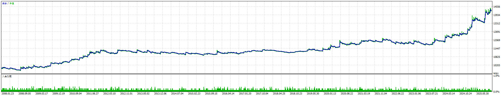
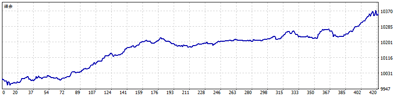
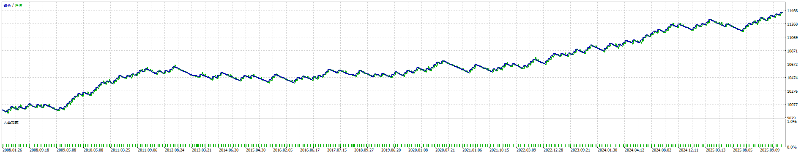
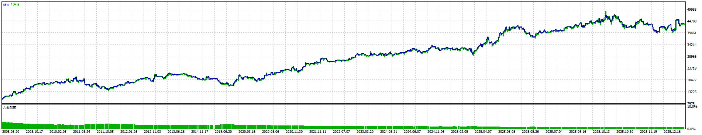

# Profitable Expert Advisor Repository

A comprehensive collection of algorithmic trading strategies for MetaTrader 5, including production-ready Expert Advisors, machine learning models, and backtesting frameworks.

## Table of Contents

- [Repository Structure](#repository-structure)
- [Frontline Strategies](#frontline-strategies) - Production-ready EAs
- [AI & Machine Learning](#ai--machine-learning) - ONNX models for price prediction
- [Back-Pedal Strategies](#back-pedal-strategies) - Alternative implementations
- [Backtesting](#backtesting) - Python backtesting framework
- [Strategy Performance](#strategy-performance)
- [Quick Start](#quick-start)
- [Disclaimer](#disclaimer)

## Repository Structure

```
profitable-expert-advisor/
├── frontline/           # Production-ready trading strategies
│   ├── MQL5/           # MetaTrader 5 Expert Advisors
│   └── tradingview/    # TradingView Pine Script strategies
├── ai/                 # ONNX machine learning models
├── back-pedal/         # Alternative/experimental strategies
├── backtesting/        # Python backtesting framework
│   ├── MT5/           # MT5 Python backtesting
│   └── own/           # Custom backtesting tools
└── paper/              # Research papers and simulations
```

## Frontline Strategies

**Location**: [`frontline/`](frontline/)

Production-ready Expert Advisors with comprehensive backtesting and performance reports.

### Available Strategies

1. **RSI Scalping Strategies**
   - RSIScalpingXAUUSD (Gold)
   - RSIScalpingBTCUSD (Bitcoin)
   - RSIScalpingMSFT (Microsoft Stock)
   - RSIScalpingTSLA (Tesla Stock)

2. **Advanced Gold Strategies**
   - RSICrossOverReversalXAUUSD
   - RSIMidPointHijackXAUUSD (Multi-strategy system)
   - EMASlopeDistanceCocktailXAUUSD
   - DarvasBoxXAUUSD

3. **TradingView Strategies**
   - SSEEMARSICocktail (Pine Script)

**Performance Reports**: All strategies include detailed HTML reports and PNG charts showing P&L, drawdown, and trade statistics.

📖 **[View Full Frontline Documentation](frontline/README.md)**

## AI & Machine Learning

**Location**: [`ai/`](ai/)

Complete framework for training and deploying ONNX machine learning models in MetaTrader 5.

### Features

- 🧠 LSTM neural networks for price prediction
- 📊 Technical indicators as features (RSI, EMA, ATR, etc.)
- 🔄 ONNX export for MQL5 integration
- 📈 Real-time prediction in Expert Advisors

### Quick Start

```bash
cd ai
pip install -r requirements.txt
python train_onnx_model.py --symbol XAUUSD --timeframe H1
```

📖 **[View Full AI Documentation](ai/README.md)**

## Back-Pedal Strategies

**Location**: [`back-pedal/`](back-pedal/)

Alternative implementations and experimental strategies for comparison and testing.

### Available Strategies

- RSIScalpingEURUSD
- RSIScalpingXAGUSD (Silver)
- RSIScalpingAPPL (Apple Stock)
- RSIReversalAsianAUDUSD
- RSIReversalAsianEURUSD
- RSIFollowReverseEMACrossOverBTCUSD

📖 **[View Back-Pedal Documentation](back-pedal/README.md)**

## Backtesting

**Location**: [`backtesting/`](backtesting/)

### MT5 Python Backtesting

Complete Python framework for backtesting strategies using MetaTrader 5 historical data.

- Base strategy class for easy implementation
- Multiple indicator support (RSI, EMA, SMA, ATR, MACD)
- Performance analysis and visualization
- Example strategies included

📖 **[View Backtesting Documentation](backtesting/MT5/README.md)**


## Strategy Performance

All strategies include comprehensive performance reports with:

- **Equity Curves**: Account balance over time
- **Drawdown Analysis**: Maximum drawdown periods
- **Trade Statistics**: Win rate, profit factor, average win/loss
- **Monthly Performance**: Month-by-month returns
- **P&L Charts**: Visual profit and loss distribution

### Performance Reports Location

- **Frontline Strategies**: `frontline/MQL5/[StrategyName]/report.png` and `report.html`
- **Back-Pedal Strategies**: `back-pedal/[StrategyName]/test-balance.png`

## Quick Start

### 1. Choose Your Strategy

- **For Production**: Use strategies from `frontline/MQL5/`
- **For Experimentation**: Try `back-pedal/` strategies
- **For ML Trading**: Explore `ai/` ONNX models

### 2. Install and Deploy

1. Copy EA file to MT5 `MQL5/Experts/` directory
2. Compile in MetaEditor (F7)
3. Review backtest reports (`report.html` and `report.png`)
4. Test on demo account
5. Deploy with appropriate risk management

### 3. Monitor Performance

- Review HTML reports for detailed statistics
- Check PNG charts for visual performance
- Monitor live trading metrics
- Adjust parameters as needed

## Legacy EA Documentation

The following sections document individual EAs from the original collection:

### 1. RSI Reversal Asian AUD/USD
- **Strategy**: RSI-based reversal trading during Asian session
- **Key Features**:
  - Uses RSI (Relative Strength Index) for entry and exit signals
  - Specifically optimized for AUD/USD pair during Asian session (00:00-08:00 UTC)
  - Implements strict risk management with configurable stop loss and take profit
  - Includes spread monitoring to avoid trading during high spread conditions
  - Features a visual panel showing real-time trading metrics

**Core Parameters:**
```mql5
// RSI Settings
RSIPeriod = 28;          // RSI period
OverboughtLevel = 64;    // Overbought level
OversoldLevel = 13;      // Oversold level

// Risk Management
TakeProfitPips = 175;    // Take profit in pips
StopLossPips = 5;        // Stop loss in pips
MaxLotSize = 0.1;        // Maximum lot size
MaxSpread = 1000;        // Maximum allowed spread in pips
MaxDuration = 140;       // Maximum trade duration in hours
```

**Performance Report:**
<div align="center">
  
</div>

### 2. RSI MidPoint Hijack XAU/USD
- **Strategy**: Multi-strategy approach combining RSI and EMA crossovers
- **Key Features**:
  - Implements three distinct strategies:
    1. RSI Follow Strategy
    2. RSI Reverse Strategy
    3. EMA Cross Strategy
  - Optimized for Gold (XAU/USD) trading
  - Includes strategy locking mechanism to protect profits
  - Features cooldown periods after losses
  - Time-based trading windows for each strategy

**Core Parameters:**
```mql5
// RSI Follow Strategy
InpRSIPeriod = 87;              // RSI Period
InpRSIOverbought = 72;          // RSI Overbought Level
InpRSIOversold = 50;            // RSI Oversold Level

// RSI Reverse Strategy
InpRSIReversePeriod = 59;       // RSI Period
InpRSIReverseOverbought = 51;   // RSI Overbought Level
InpRSIReverseOversold = 49;     // RSI Oversold Level

// Strategy Management
InpEnableStrategyLock = false;   // Enable Strategy Lock
InpLockProfitThreshold = 0.0;   // Lock Profit Threshold (pips)
```

**Performance Report:**
<div align="center">
  
</div>

### 3. RSI Reversal Asian EUR/USD
- **Strategy**: Similar to AUD/USD version but optimized for EUR/USD
- **Key Features**:
  - RSI-based reversal strategy during Asian session
  - Customized parameters for EUR/USD pair
  - Risk management features
  - Session-based trading

**Core Parameters:**
```mql5
// RSI Settings
RSIPeriod = 14;          // RSI period
OverboughtLevel = 78;    // Overbought level
OversoldLevel = 20;      // Oversold level

// Risk Management
TakeProfitPips = 635;    // Take profit in pips
StopLossPips = 290;      // Stop loss in pips
MaxLotSize = 0.1;        // Maximum lot size
MaxDuration = 22;        // Maximum trade duration in hours
RSIExitLevel = 57;       // RSI level to exit
```

**Performance Report:**
<div align="center">
  
</div>

### 4. RSI CrossOver Reversal XAU/USD
- **Strategy**: RSI crossover strategy for Gold trading
- **Key Features**:
  - Uses RSI crossovers for entry and exit signals
  - Optimized for Gold market conditions
  - Includes multiple timeframe analysis
  - Risk management features

**Core Parameters:**
```mql5
// RSI Settings
rsiPeriod = 19;           // RSI period
overboughtLevel = 93;     // Overbought level
oversoldLevel = 22;       // Oversold level

// EMA Settings
emaPeriod = 140;          // EMA period
emaSlopeThreshold = 105;  // EMA slope threshold
emaDistanceThreshold = 165; // EMA distance threshold

// Risk Management
TrailingStop = 295;       // Trailing stop in pips
```

**Performance Report:**
<div align="center">
  
</div>

### 5. RSI Follow Reverse EMA CrossOver BTC/USD
- **Strategy**: Multi-strategy approach combining RSI Follow, RSI Reverse, and EMA crossovers
- **Key Features**:
  - Implements three distinct strategies:
    1. RSI Follow Strategy
    2. RSI Reverse Strategy
    3. EMA Cross Strategy
  - Optimized for Bitcoin (BTC/USD) trading
  - Includes strategy locking mechanism to protect profits
  - Features cooldown periods after losses
  - Time-based trading windows for each strategy
  - Adaptive position sizing based on volatility

**Core Parameters:**
```mql5
// RSI Follow Strategy
InpRSIPeriod = 14;              // RSI Period
InpRSIOverbought = 70;          // RSI Overbought Level
InpRSIOversold = 30;            // RSI Oversold Level

// RSI Reverse Strategy
InpRSIReversePeriod = 14;       // RSI Period
InpRSIReverseOverbought = 80;   // RSI Overbought Level
InpRSIReverseOversold = 20;     // RSI Oversold Level

// EMA Settings
InpEMAPeriod = 200;             // EMA Period
InpEMASlopeThreshold = 0.1;     // EMA Slope Threshold
InpEMADistanceThreshold = 100;  // EMA Distance Threshold

// Strategy Management
InpEnableStrategyLock = true;    // Enable Strategy Lock
InpLockProfitThreshold = 1000;  // Lock Profit Threshold (pips)
InpCooldownPeriod = 24;         // Cooldown Period in hours
```

**Performance Report:**
<div align="center">
  
</div>

### 6. DarvasBoxXAUUSD
- **Strategy**: Darvas Box breakout strategy for Gold trading
- **Key Features**:
  - Implements the classic Darvas Box theory for trend identification
  - Specifically optimized for Gold (XAU/USD) trading
  - Features dynamic box size adjustment based on volatility
  - Includes multiple timeframe analysis
  - Implements strict risk management with configurable stop loss and take profit
  - Features a visual panel showing real-time box levels and trading metrics

**Core Parameters:**
```mql5
// Box Settings
BoxPeriod = 20;          // Box formation period
MinBoxSize = 50;         // Minimum box size in pips
MaxBoxSize = 200;        // Maximum box size in pips
VolatilityFactor = 1.5;  // Volatility adjustment factor

// Risk Management
TakeProfitPips = 300;    // Take profit in pips
StopLossPips = 150;      // Stop loss in pips
MaxLotSize = 0.1;        // Maximum lot size
MaxSpread = 1000;        // Maximum allowed spread in pips
MaxDuration = 48;        // Maximum trade duration in hours

// Timeframe Settings
PrimaryTF = PERIOD_H1;   // Primary timeframe
SecondaryTF = PERIOD_H4; // Secondary timeframe for confirmation
```

**Performance Report:**
<div align="center">
  
</div>

### 7. EMASlopeDistanceCocktailXAUUSD
- **Strategy**: Advanced EMA-based strategy combining slope and distance analysis
- **Key Features**:
  - Uses EMA slope and price distance for entry signals
  - Implements a sophisticated scoring system
  - Dynamic stop loss and take profit based on ATR
  - Trailing stop functionality
  - Cooldown periods to prevent over-trading
  - Maximum drawdown protection
  - Time-based position management

**Core Parameters:**
```mql5
// EMA Settings
emaPeriod = 64;              // EMA period
emaTimeFrame = PERIOD_H1;    // EMA Timeframe
slopeThreshold = 82;         // EMA slope threshold
distanceThreshold = 17.5;    // Distance threshold

// Risk Management
atrMultiplier = 7.6;        // ATR multiplier for SL/TP
TrailingStop = 335;         // Trailing stop in points
max_drawdown = 0.1;         // Maximum drawdown percentage
minimumLotSize = 0.03;      // Minimum lot size
maxTimeInPosition = 2;      // Maximum time in position (hours)

// Strategy Control
scoreThreshold = 5200;      // Score threshold for trade entry
maxScore = 7900;            // Maximum score value
cooldownMinutes = 18;       // Cooldown period
tradeCooldownMinutes = 19;  // Trade debounce period
```

**Performance Metrics:**
- Yearly return: 28%
- Profit Factor: 1.222
- Recovery Factor: 7.17
- Expected Payoff: 1.3
- Sharpe Ratio: 4.11
- Maximum Drawdown: 14.00%
- Win Rate: 64.65%
- Total Trades: 2863

**Performance Report:**
<div align="center">
  
</div>

## Strategy Rationale

### RSI Reversal Strategy
The RSI Reversal strategy is based on the principle that markets tend to revert to their mean after reaching extreme conditions. The strategy:
- Enters trades when RSI reaches overbought/oversold levels
- Uses Asian session timing to capitalize on specific market conditions
- Implements strict risk management to protect capital
- Takes advantage of mean reversion tendencies in currency pairs

### RSI MidPoint Hijack Strategy
This advanced strategy combines multiple approaches:
- RSI Follow: Capitalizes on strong trends
- RSI Reverse: Takes advantage of market reversals
- EMA Cross: Provides additional confirmation signals
- Strategy locking: Protects profits during favorable conditions
- Cooldown periods: Prevents over-trading after losses

### RSI CrossOver Reversal Strategy
This strategy focuses on RSI crossover signals:
- Uses RSI crossovers as primary entry signals
- Combines with EMA for trend confirmation
- Implements multiple timeframe analysis
- Optimized for Gold market volatility
- Features dynamic stop loss and take profit levels

### Darvas Box Strategy
The Darvas Box strategy is based on Nicolas Darvas' box theory:
- Identifies consolidation periods as "boxes"
- Trades breakouts from these boxes
- Uses dynamic box sizing based on volatility
- Implements multiple timeframe confirmation
- Features strict risk management rules

### EMA Slope Distance Cocktail Strategy
This sophisticated strategy combines multiple technical elements:
- EMA Slope Analysis:
  - Monitors the rate of change in EMA
  - Uses slope thresholds for trend confirmation
  - Implements slope-based scoring system
- Distance Analysis:
  - Measures price distance from EMA
  - Uses distance thresholds for entry signals
  - Implements mean reversion principles
- Advanced Risk Management:
  - Dynamic ATR-based stop losses
  - Trailing stop functionality
  - Maximum drawdown protection
  - Time-based position management
- Scoring System:
  - Combines multiple factors into a single score
  - Uses thresholds for trade entry/exit
  - Implements cooldown periods
  - Features maximum score clamping

## Profitability Factors

These EAs are designed to be profitable in the long run due to:

1. **Risk Management**
   - Strict stop loss implementation
   - Take profit targets
   - Spread monitoring
   - Position sizing control

2. **Market Timing**
   - Session-based trading
   - Time-specific entry and exit rules
   - Avoidance of high volatility periods

3. **Strategy Diversification**
   - Multiple entry and exit conditions
   - Different timeframes
   - Various technical indicators

4. **Adaptive Features**
   - Strategy locking during profitable periods
   - Cooldown periods after losses
   - Spread-based trade filtering

## Usage

### For Production Trading

1. **Review Performance Reports**: Check `report.html` and `report.png` in each strategy folder
2. **Test on Demo**: Always test on demo account first
3. **Configure Parameters**: Adjust based on your risk tolerance
4. **Deploy**: Copy EA to MT5 and attach to chart
5. **Monitor**: Regularly review performance and adjust as needed

### Parameter Configuration

Each EA comes with configurable parameters that can be adjusted based on:
- Market conditions
- Risk tolerance
- Trading style
- Account size

Please refer to:
- Individual EA files for parameter descriptions
- `frontline/README.md` for production strategies
- `back-pedal/README.md` for alternative implementations
- `ai/README.md` for machine learning models

## Disclaimer

Trading involves substantial risk of loss. These EAs are provided for educational purposes only. Always test thoroughly on a demo account before using with real money. Past performance does not guarantee future results.
