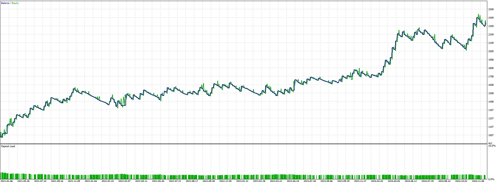

# Profitable Expert Advisors Collection

## Project Overview
This repository contains a collection of profitable MetaTrader 5 (MT5) Expert Advisors, each implementing different trading strategies. These EAs have been developed and tested for optimal performance in various market conditions.

## Available Expert Advisors

### 1. RSI Divergence Rebound
A strategy that combines RSI (Relative Strength Index) divergence detection with price action analysis to identify potential reversal points in the market.

**Key Features:**
- RSI divergence patterns detection (bullish and bearish)
- Price rebound confirmation
- Risk management through stop loss and take profit levels

**Strategy Settings:**
- Symbol: XAUUSD
- Period: H1 (2021.01.01 - 2025.01.01)
- RSI Period: 14
- RSI Overbought: 70
- RSI Oversold: 30
- Base Lot Size: 0.01
- ATR Period: 14
- ATR SL Multiplier: 3
- ATR TP Multiplier: 10
- Max Spread: 50
- Divergence Lookback: 9
- Min Trade Interval: 30
- Max Risk Percent: 2%
- Max Drawdown Percent: 10%
- Max Consecutive Losses: 3
- Max Lot Size: 0.1

**Performance Metrics:**
| Metric | Value |
|--------|-------|
| Total Net Profit | $1,344.74 |
| Gross Profit | $4,410.51 |
| Gross Loss | -$3,065.77 |
| Profit Factor | 1.44 |
| Recovery Factor | 4.91 |
| Expected Payoff | $4.87 |
| Sharpe Ratio | 1.69 |
| AHPR | 1.0033 (0.33%) |
| GHPR | 1.0031 (0.31%) |

**Trade Statistics:**
| Statistic | Value |
|-----------|-------|
| Total Trades | 276 |
| Total Deals | 552 |
| Profit Trades | 81 (29.35%) |
| Loss Trades | 195 (70.65%) |
| Short Trades Won | 26.28% |
| Long Trades Won | 32.37% |
| Largest Profit Trade | $144.46 |
| Largest Loss Trade | -$46.66 |
| Average Profit Trade | $54.45 |
| Average Loss Trade | -$15.72 |
| Max Consecutive Wins | 3 ($179.71) |
| Max Consecutive Losses | 15 (-$159.89) |

**Drawdown Analysis:**
| Metric | Value |
|--------|-------|
| Balance Drawdown Absolute | $18.62 |
| Equity Drawdown Absolute | $19.45 |
| Balance Drawdown Maximal | $231.79 (10.21%) |
| Equity Drawdown Maximal | $273.75 (11.93%) |
| Balance Drawdown Relative | 13.47% ($210.14) |
| Equity Drawdown Relative | 15.85% ($250.78) |

**Balance Sheet:**

## Technical Details
Each EA is implemented in MQL5 and includes:
- Custom strategy implementation
- Entry/exit logic
- Risk management parameters
- Position sizing rules

## Requirements
- MetaTrader 5 platform
- MQL5 programming language support
- Sufficient historical data for backtesting

## Installation
1. Copy the desired EA file to your MT5 Experts folder
2. Compile the EA in MetaEditor
3. Attach the EA to a chart with appropriate settings

## Disclaimer
These Expert Advisors are for educational and research purposes only. Past performance does not guarantee future results. Always test thoroughly before using in live trading.
