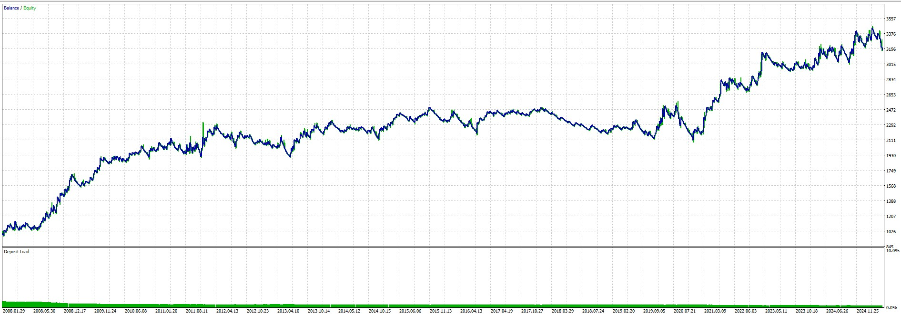
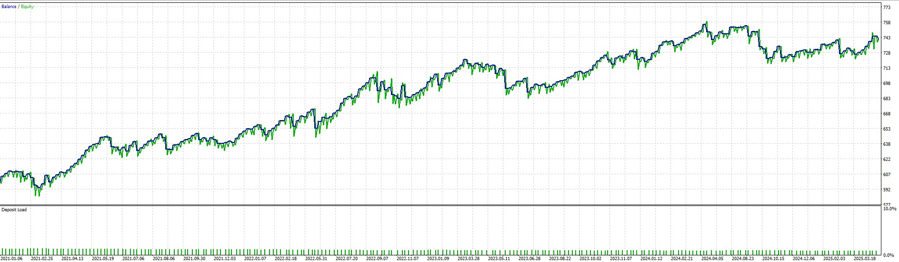

# Profitable Expert Advisors Collection

## Project Overview
This repository contains a collection of profitable MetaTrader 5 (MT5) Expert Advisors, each implementing different trading strategies. These EAs have been developed and tested for optimal performance in various market conditions.

## Available Expert Advisors

### 1. RSI Divergence Rebound
A strategy that combines RSI (Relative Strength Index) divergence detection with price action analysis to identify potential reversal points in the market.

**Key Features:**
- RSI divergence patterns detection (bullish and bearish)
- Price rebound confirmation
- Risk management through stop loss and take profit levels

**Strategy Settings:**
- Symbol: XAUUSD
- Period: H1 (2021.01.01 - 2025.01.01)
- RSI Period: 14
- RSI Overbought: 70
- RSI Oversold: 30
- Base Lot Size: 0.01
- ATR Period: 14
- ATR SL Multiplier: 3
- ATR TP Multiplier: 10
- Max Spread: 50
- Divergence Lookback: 9
- Min Trade Interval: 30
- Max Risk Percent: 2%
- Max Drawdown Percent: 10%
- Max Consecutive Losses: 3
- Max Lot Size: 0.1

**Performance Metrics (2021-2025):**
| Metric | Value |
|--------|-------|
| Total Net Profit | $1,344.74 |
| Gross Profit | $4,410.51 |
| Gross Loss | -$3,065.77 |
| Profit Factor | 1.44 |
| Recovery Factor | 4.91 |
| Expected Payoff | $4.87 |
| Sharpe Ratio | 1.69 |
| AHPR | 1.0033 (0.33%) |
| GHPR | 1.0031 (0.31%) |

**Trade Statistics (2021-2025):**
| Statistic | Value |
|-----------|-------|
| Total Trades | 276 |
| Total Deals | 552 |
| Profit Trades | 81 (29.35%) |
| Loss Trades | 195 (70.65%) |
| Short Trades Won | 26.28% |
| Long Trades Won | 32.37% |
| Largest Profit Trade | $144.46 |
| Largest Loss Trade | -$46.66 |
| Average Profit Trade | $54.45 |
| Average Loss Trade | -$15.72 |
| Max Consecutive Wins | 3 ($179.71) |
| Max Consecutive Losses | 15 (-$159.89) |

**Drawdown Analysis (2021-2025):**
| Metric | Value |
|--------|-------|
| Balance Drawdown Absolute | $18.62 |
| Equity Drawdown Absolute | $19.45 |
| Balance Drawdown Maximal | $231.79 (10.21%) |
| Equity Drawdown Maximal | $273.75 (11.93%) |
| Balance Drawdown Relative | 13.47% ($210.14) |
| Equity Drawdown Relative | 15.85% ($250.78) |

**Balance Sheet (2021-2025):**

**Additional Test Results (2008):**

### 2. EMA Crossover Skirmish
A strategy that uses Exponential Moving Average (EMA) crossovers with advanced scoring and position management.

**Key Features:**
- EMA crossover detection
- Advanced scoring system
- Trailing stop management
- Position scaling and reversal capabilities

**Strategy Settings:**
- Symbol: XAUUSD
- Period: H1 (2021.01.01 - 2025.04.11)
- Magic Number: 42
- Score Threshold: 5200
- Slope Threshold: 93
- Max Score: 7900.0
- Cooldown Minutes: 18
- Trade Cooldown Minutes: 24
- EMA Time Frame: 16385
- EMA Period: 64
- Cross Over Step: 950.0
- Slope Threshold Step: 635.0
- EMA Distance Step: 150.0
- ATR Multiplier: 7.6
- Trailing Stop: 5.0
- Max Crossover Trades: 4
- Max Drawdown: 10%
- Minimum Lot Size: 0.01
- Max Time in Position: 9 hours
- Trade Length Threshold: 98
- Reverse TP: 32
- Reverse Lot Size Multiplier: 15
- Secondary Position Hold Time: 32

**Performance Metrics (2021-2025):**
| Metric | Value |
|--------|-------|
| Total Net Profit | $388.52 |
| Gross Profit | $391.65 |
| Gross Loss | -$3.13 |
| Profit Factor | 125.13 |
| Recovery Factor | 11.66 |
| Expected Payoff | $0.72 |
| Sharpe Ratio | 41.49 |
| AHPR | 1.0006 (0.06%) |
| GHPR | 1.0006 (0.06%) |

**Trade Statistics (2021-2025):**
| Statistic | Value |
|-----------|-------|
| History Quality | 82% real ticks |
| Total Bars | 25,283 |
| Total Ticks | 165,999,507 |
| Balance Drawdown Absolute | $0.00 |
| Equity Drawdown Absolute | $0.10 |
| Balance Drawdown Maximal | $0.69 (0.05%) |
| Equity Drawdown Maximal | $33.32 (2.56%) |
| Balance Drawdown Relative | 0.05% ($0.69) |
| Equity Drawdown Relative | 2.92% ($30.23) |

**Balance Sheet (2021-2025):**

**Additional Test Results (2008):**

### 3. RSI Divergence Extrema

A strategy that combines RSI divergence with extreme price points detection for enhanced market reversal signals.

**Key Features:**
- RSI divergence patterns detection
- Extreme price points identification
- Dynamic exit based on RSI thresholds
- Advanced risk management

**Strategy Settings:**
- Symbol: AUDUSD
- Period: H1 (2021.01.01 - 2025.04.11)
- RSI Period: 14
- RSI Overbought: 70
- RSI Oversold: 30
- Base Lot Size: 0.01
- Exit Buy RSI Threshold: 60.0
- Exit Sell RSI Threshold: 40.0
- Bar Time Frame: 16385

**Performance Metrics (2021-2025):**
| Metric | Value |
|--------|-------|
| Total Net Profit | $141.61 |
| Gross Profit | $508.54 |
| Gross Loss | -$366.93 |
| Profit Factor | 1.39 |
| Recovery Factor | 3.37 |
| Expected Payoff | $0.59 |
| Sharpe Ratio | 1.72 |
| AHPR | 1.0009 (0.09%) |
| GHPR | 1.0009 (0.09%) |

**Trade Statistics (2021-2025):**
| Statistic | Value |
|-----------|-------|
| History Quality | 82% real ticks |
| Total Bars | 26,604 |
| Total Ticks | 116,467,811 |
| Total Trades | 240 |
| Total Deals | 480 |
| Profit Trades | 158 (65.83%) |
| Loss Trades | 82 (34.17%) |
| Short Trades Won | 70.73% |
| Long Trades Won | 60.68% |
| Largest Profit Trade | $12.35 |
| Largest Loss Trade | -$18.76 |
| Average Profit Trade | $3.22 |
| Average Loss Trade | -$4.47 |
| Max Consecutive Wins | 11 ($35.96) |
| Max Consecutive Losses | 4 (-$26.61) |

**Drawdown Analysis (2021-2025):**
| Metric | Value |
|--------|-------|
| Balance Drawdown Absolute | $6.16 |
| Equity Drawdown Absolute | $14.13 |
| Balance Drawdown Maximal | $34.06 (4.50%) |
| Equity Drawdown Maximal | $42.06 (5.54%) |
| Balance Drawdown Relative | 4.55% ($32.84) |
| Equity Drawdown Relative | 5.54% ($42.06) |

**Balance Sheet (2021-2025):**

## Technical Details
Each EA is implemented in MQL5 and includes:
- Custom strategy implementation
- Entry/exit logic
- Risk management parameters
- Position sizing rules

## Requirements
- MetaTrader 5 platform
- MQL5 programming language support
- Sufficient historical data for backtesting

## Installation
1. Copy the desired EA file to your MT5 Experts folder
2. Compile the EA in MetaEditor
3. Attach the EA to a chart with appropriate settings

## Disclaimer
These Expert Advisors are for educational and research purposes only. Past performance does not guarantee future results. Always test thoroughly before using in live trading.
