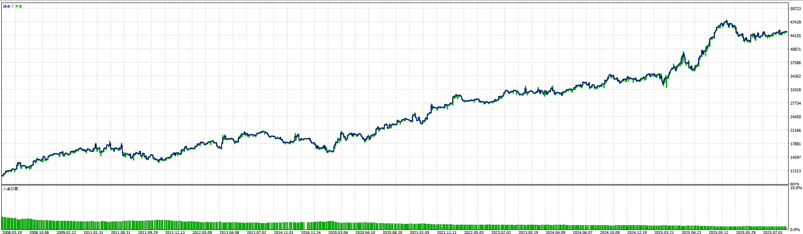

# Table of Contents

- [Table of Contents](#table-of-contents)
- [Profitable Expert Advisors (EAs)](#profitable-expert-advisors-eas)
  - [Available EAs](#available-eas)
    - [1. RSI Reversal Asian AUD/USD](#1-rsi-reversal-asian-audusd)
    - [2. RSI MidPoint Hijack XAU/USD](#2-rsi-midpoint-hijack-xauusd)
    - [3. RSI Reversal Asian EUR/USD](#3-rsi-reversal-asian-eurusd)
    - [4. RSI CrossOver Reversal XAU/USD](#4-rsi-crossover-reversal-xauusd)
    - [5. RSI Follow Reverse EMA CrossOver BTC/USD](#5-rsi-follow-reverse-ema-crossover-btcusd)
    - [6. DarvasBoxXAUUSD](#6-darvasboxxauusd)
    - [7. EMASlopeDistanceCocktailXAUUSD](#7-emaslopedistancecocktailxauusd)
  - [Strategy Rationale](#strategy-rationale)
    - [RSI Reversal Strategy](#rsi-reversal-strategy)
    - [RSI MidPoint Hijack Strategy](#rsi-midpoint-hijack-strategy)
    - [RSI CrossOver Reversal Strategy](#rsi-crossover-reversal-strategy)
    - [Darvas Box Strategy](#darvas-box-strategy)
    - [EMA Slope Distance Cocktail Strategy](#ema-slope-distance-cocktail-strategy)
  - [Profitability Factors](#profitability-factors)
  - [Usage](#usage)
  - [Disclaimer](#disclaimer)


# Profitable Expert Advisors (EAs)

This repository contains a collection of profitable Expert Advisors (EAs) designed for MetaTrader 5. Each EA implements different trading strategies optimized for specific currency pairs and market conditions.

## Available EAs

### 1. RSI Reversal Asian AUD/USD
- **Strategy**: RSI-based reversal trading during Asian session
- **Key Features**:
  - Uses RSI (Relative Strength Index) for entry and exit signals
  - Specifically optimized for AUD/USD pair during Asian session (00:00-08:00 UTC)
  - Implements strict risk management with configurable stop loss and take profit
  - Includes spread monitoring to avoid trading during high spread conditions
  - Features a visual panel showing real-time trading metrics

**Core Parameters:**
```mql5
// RSI Settings
RSIPeriod = 28;          // RSI period
OverboughtLevel = 64;    // Overbought level
OversoldLevel = 13;      // Oversold level

// Risk Management
TakeProfitPips = 175;    // Take profit in pips
StopLossPips = 5;        // Stop loss in pips
MaxLotSize = 0.1;        // Maximum lot size
MaxSpread = 1000;        // Maximum allowed spread in pips
MaxDuration = 140;       // Maximum trade duration in hours
```

**Test Balance Results:**
<div align="center">
  
</div>

### 2. RSI MidPoint Hijack XAU/USD
- **Strategy**: Multi-strategy approach combining RSI and EMA crossovers
- **Key Features**:
  - Implements three distinct strategies:
    1. RSI Follow Strategy
    2. RSI Reverse Strategy
    3. EMA Cross Strategy
  - Optimized for Gold (XAU/USD) trading
  - Includes strategy locking mechanism to protect profits
  - Features cooldown periods after losses
  - Time-based trading windows for each strategy

**Core Parameters:**
```mql5
// RSI Follow Strategy
InpRSIPeriod = 87;              // RSI Period
InpRSIOverbought = 72;          // RSI Overbought Level
InpRSIOversold = 50;            // RSI Oversold Level

// RSI Reverse Strategy
InpRSIReversePeriod = 59;       // RSI Period
InpRSIReverseOverbought = 51;   // RSI Overbought Level
InpRSIReverseOversold = 49;     // RSI Oversold Level

// Strategy Management
InpEnableStrategyLock = false;   // Enable Strategy Lock
InpLockProfitThreshold = 0.0;   // Lock Profit Threshold (pips)
```

**Test Balance Results:**
<div align="center">
  
</div>

### 3. RSI Reversal Asian EUR/USD
- **Strategy**: Similar to AUD/USD version but optimized for EUR/USD
- **Key Features**:
  - RSI-based reversal strategy during Asian session
  - Customized parameters for EUR/USD pair
  - Risk management features
  - Session-based trading

**Core Parameters:**
```mql5
// RSI Settings
RSIPeriod = 14;          // RSI period
OverboughtLevel = 78;    // Overbought level
OversoldLevel = 20;      // Oversold level

// Risk Management
TakeProfitPips = 635;    // Take profit in pips
StopLossPips = 290;      // Stop loss in pips
MaxLotSize = 0.1;        // Maximum lot size
MaxDuration = 22;        // Maximum trade duration in hours
RSIExitLevel = 57;       // RSI level to exit
```

**Test Balance Results:**
<div align="center">
  
</div>

### 4. RSI CrossOver Reversal XAU/USD
- **Strategy**: RSI crossover strategy for Gold trading
- **Key Features**:
  - Uses RSI crossovers for entry and exit signals
  - Optimized for Gold market conditions
  - Includes multiple timeframe analysis
  - Risk management features

**Core Parameters:**
```mql5
// RSI Settings
rsiPeriod = 19;           // RSI period
overboughtLevel = 93;     // Overbought level
oversoldLevel = 22;       // Oversold level

// EMA Settings
emaPeriod = 140;          // EMA period
emaSlopeThreshold = 105;  // EMA slope threshold
emaDistanceThreshold = 165; // EMA distance threshold

// Risk Management
TrailingStop = 295;       // Trailing stop in pips
```

**Test Balance Results:**
<div align="center">
  
</div>

### 5. RSI Follow Reverse EMA CrossOver BTC/USD
- **Strategy**: Multi-strategy approach combining RSI Follow, RSI Reverse, and EMA crossovers
- **Key Features**:
  - Implements three distinct strategies:
    1. RSI Follow Strategy
    2. RSI Reverse Strategy
    3. EMA Cross Strategy
  - Optimized for Bitcoin (BTC/USD) trading
  - Includes strategy locking mechanism to protect profits
  - Features cooldown periods after losses
  - Time-based trading windows for each strategy
  - Adaptive position sizing based on volatility

**Core Parameters:**
```mql5
// RSI Follow Strategy
InpRSIPeriod = 14;              // RSI Period
InpRSIOverbought = 70;          // RSI Overbought Level
InpRSIOversold = 30;            // RSI Oversold Level

// RSI Reverse Strategy
InpRSIReversePeriod = 14;       // RSI Period
InpRSIReverseOverbought = 80;   // RSI Overbought Level
InpRSIReverseOversold = 20;     // RSI Oversold Level

// EMA Settings
InpEMAPeriod = 200;             // EMA Period
InpEMASlopeThreshold = 0.1;     // EMA Slope Threshold
InpEMADistanceThreshold = 100;  // EMA Distance Threshold

// Strategy Management
InpEnableStrategyLock = true;    // Enable Strategy Lock
InpLockProfitThreshold = 1000;  // Lock Profit Threshold (pips)
InpCooldownPeriod = 24;         // Cooldown Period in hours
```

**Test Balance Results:**
<div align="center">
  
</div>

### 6. DarvasBoxXAUUSD
- **Strategy**: Darvas Box breakout strategy for Gold trading
- **Key Features**:
  - Implements the classic Darvas Box theory for trend identification
  - Specifically optimized for Gold (XAU/USD) trading
  - Features dynamic box size adjustment based on volatility
  - Includes multiple timeframe analysis
  - Implements strict risk management with configurable stop loss and take profit
  - Features a visual panel showing real-time box levels and trading metrics

**Core Parameters:**
```mql5
// Box Settings
BoxPeriod = 20;          // Box formation period
MinBoxSize = 50;         // Minimum box size in pips
MaxBoxSize = 200;        // Maximum box size in pips
VolatilityFactor = 1.5;  // Volatility adjustment factor

// Risk Management
TakeProfitPips = 300;    // Take profit in pips
StopLossPips = 150;      // Stop loss in pips
MaxLotSize = 0.1;        // Maximum lot size
MaxSpread = 1000;        // Maximum allowed spread in pips
MaxDuration = 48;        // Maximum trade duration in hours

// Timeframe Settings
PrimaryTF = PERIOD_H1;   // Primary timeframe
SecondaryTF = PERIOD_H4; // Secondary timeframe for confirmation
```

**Test Balance Results:**
<div align="center">
  
</div>

### 7. EMASlopeDistanceCocktailXAUUSD
- **Strategy**: Advanced EMA-based strategy combining slope and distance analysis
- **Key Features**:
  - Uses EMA slope and price distance for entry signals
  - Implements a sophisticated scoring system
  - Dynamic stop loss and take profit based on ATR
  - Trailing stop functionality
  - Cooldown periods to prevent over-trading
  - Maximum drawdown protection
  - Time-based position management

**Core Parameters:**
```mql5
// EMA Settings
emaPeriod = 64;              // EMA period
emaTimeFrame = PERIOD_H1;    // EMA Timeframe
slopeThreshold = 82;         // EMA slope threshold
distanceThreshold = 17.5;    // Distance threshold

// Risk Management
atrMultiplier = 7.6;        // ATR multiplier for SL/TP
TrailingStop = 335;         // Trailing stop in points
max_drawdown = 0.1;         // Maximum drawdown percentage
minimumLotSize = 0.03;      // Minimum lot size
maxTimeInPosition = 2;      // Maximum time in position (hours)

// Strategy Control
scoreThreshold = 5200;      // Score threshold for trade entry
maxScore = 7900;            // Maximum score value
cooldownMinutes = 18;       // Cooldown period
tradeCooldownMinutes = 19;  // Trade debounce period
```

**Performance Metrics:**
- Yearly return: 28%
- Profit Factor: 1.222
- Recovery Factor: 7.17
- Expected Payoff: 1.3
- Sharpe Ratio: 4.11
- Maximum Drawdown: 14.00%
- Win Rate: 64.65%
- Total Trades: 2863

**Test Balance Results:**
<div align="center">
  
</div>

## Strategy Rationale

### RSI Reversal Strategy
The RSI Reversal strategy is based on the principle that markets tend to revert to their mean after reaching extreme conditions. The strategy:
- Enters trades when RSI reaches overbought/oversold levels
- Uses Asian session timing to capitalize on specific market conditions
- Implements strict risk management to protect capital
- Takes advantage of mean reversion tendencies in currency pairs

### RSI MidPoint Hijack Strategy
This advanced strategy combines multiple approaches:
- RSI Follow: Capitalizes on strong trends
- RSI Reverse: Takes advantage of market reversals
- EMA Cross: Provides additional confirmation signals
- Strategy locking: Protects profits during favorable conditions
- Cooldown periods: Prevents over-trading after losses

### RSI CrossOver Reversal Strategy
This strategy focuses on RSI crossover signals:
- Uses RSI crossovers as primary entry signals
- Combines with EMA for trend confirmation
- Implements multiple timeframe analysis
- Optimized for Gold market volatility
- Features dynamic stop loss and take profit levels

### Darvas Box Strategy
The Darvas Box strategy is based on Nicolas Darvas' box theory:
- Identifies consolidation periods as "boxes"
- Trades breakouts from these boxes
- Uses dynamic box sizing based on volatility
- Implements multiple timeframe confirmation
- Features strict risk management rules

### EMA Slope Distance Cocktail Strategy
This sophisticated strategy combines multiple technical elements:
- EMA Slope Analysis:
  - Monitors the rate of change in EMA
  - Uses slope thresholds for trend confirmation
  - Implements slope-based scoring system
- Distance Analysis:
  - Measures price distance from EMA
  - Uses distance thresholds for entry signals
  - Implements mean reversion principles
- Advanced Risk Management:
  - Dynamic ATR-based stop losses
  - Trailing stop functionality
  - Maximum drawdown protection
  - Time-based position management
- Scoring System:
  - Combines multiple factors into a single score
  - Uses thresholds for trade entry/exit
  - Implements cooldown periods
  - Features maximum score clamping

## Profitability Factors

These EAs are designed to be profitable in the long run due to:

1. **Risk Management**
   - Strict stop loss implementation
   - Take profit targets
   - Spread monitoring
   - Position sizing control

2. **Market Timing**
   - Session-based trading
   - Time-specific entry and exit rules
   - Avoidance of high volatility periods

3. **Strategy Diversification**
   - Multiple entry and exit conditions
   - Different timeframes
   - Various technical indicators

4. **Adaptive Features**
   - Strategy locking during profitable periods
   - Cooldown periods after losses
   - Spread-based trade filtering

## Usage

Each EA comes with configurable parameters that can be adjusted based on:
- Market conditions
- Risk tolerance
- Trading style
- Account size

Please refer to the individual EA files for specific parameter descriptions and recommended settings.

## Disclaimer

Trading involves substantial risk of loss. These EAs are provided for educational purposes only. Always test thoroughly on a demo account before using with real money. Past performance does not guarantee future results.
