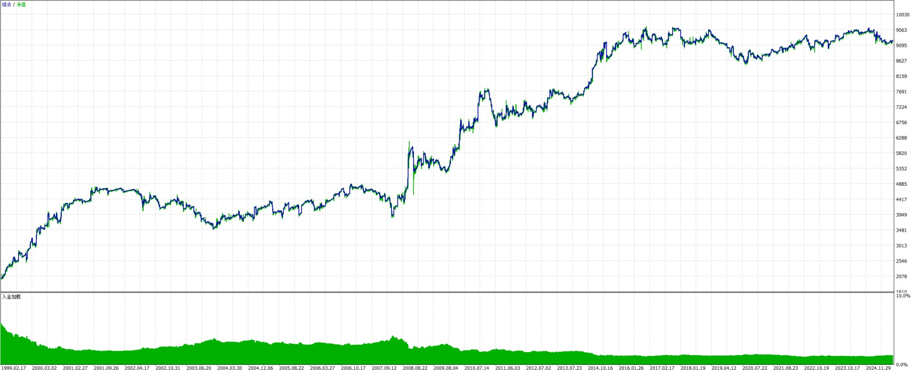

# Table of Contents
- [Table of Contents](#table-of-contents)
- [Profitable Expert Advisors Collection](#profitable-expert-advisors-collection)
  - [Project Overview](#project-overview)
  - [Available Expert Advisors](#available-expert-advisors)
    - [1. RSI Divergence Rebound](#1-rsi-divergence-rebound)
    - [2. EMA Crossover Skirmish](#2-ema-crossover-skirmish)
    - [3. RSI Divergence Extrema AUDUSD](#3-rsi-divergence-extrema-audusd)
    - [4. RSI Divergence Extrema EURUSD](#4-rsi-divergence-extrema-eurusd)
    - [5. RSI Reversal Asian AUDUSD](#5-rsi-reversal-asian-audusd)
    - [6. RSI Reversal Asian EURUSD](#6-rsi-reversal-asian-eurusd)
    - [7. EMA Crossover BTC](#7-ema-crossover-btc)
    - [8. Smart RSI BTC](#8-smart-rsi-btc)
  - [Technical Details](#technical-details)
  - [Requirements](#requirements)
  - [Installation](#installation)
  - [Disclaimer](#disclaimer)

# Profitable Expert Advisors Collection

## Project Overview
This repository contains a collection of profitable MetaTrader 5 (MT5) Expert Advisors, each implementing different trading strategies. These EAs have been developed and tested for optimal performance in various market conditions.

## Available Expert Advisors

### 1. RSI Divergence Rebound
A strategy that combines RSI (Relative Strength Index) divergence detection with price action analysis to identify potential reversal points in the market.

**Key Features:**
- RSI divergence patterns detection (bullish and bearish)
- Price rebound confirmation
- Risk management through stop loss and take profit levels

**Strategy Settings:**
- Symbol: XAUUSD
- Period: H1 (2021.01.01 - 2025.01.01)
- RSI Period: 14
- RSI Overbought: 70
- RSI Oversold: 30
- Base Lot Size: 0.01
- ATR Period: 14
- ATR SL Multiplier: 3
- ATR TP Multiplier: 10
- Max Spread: 50
- Divergence Lookback: 9
- Min Trade Interval: 30
- Max Risk Percent: 2%
- Max Drawdown Percent: 10%
- Max Consecutive Losses: 3
- Max Lot Size: 0.1

**Performance Metrics (2021-2025):**
| Metric | Value |
|--------|-------|
| Total Net Profit | $1,344.74 |
| Gross Profit | $4,410.51 |
| Gross Loss | -$3,065.77 |
| Profit Factor | 1.44 |
| Recovery Factor | 4.91 |
| Expected Payoff | $4.87 |
| Sharpe Ratio | 1.69 |
| AHPR | 1.0033 (0.33%) |
| GHPR | 1.0031 (0.31%) |

**Trade Statistics (2021-2025):**
| Statistic | Value |
|-----------|-------|
| Total Trades | 276 |
| Total Deals | 552 |
| Profit Trades | 81 (29.35%) |
| Loss Trades | 195 (70.65%) |
| Short Trades Won | 26.28% |
| Long Trades Won | 32.37% |
| Largest Profit Trade | $144.46 |
| Largest Loss Trade | -$46.66 |
| Average Profit Trade | $54.45 |
| Average Loss Trade | -$15.72 |
| Max Consecutive Wins | 3 ($179.71) |
| Max Consecutive Losses | 15 (-$159.89) |

**Drawdown Analysis (2021-2025):**
| Metric | Value |
|--------|-------|
| Balance Drawdown Absolute | $18.62 |
| Equity Drawdown Absolute | $19.45 |
| Balance Drawdown Maximal | $231.79 (10.21%) |
| Equity Drawdown Maximal | $273.75 (11.93%) |
| Balance Drawdown Relative | 13.47% ($210.14) |
| Equity Drawdown Relative | 15.85% ($250.78) |

**Balance Sheet (2021-2025):**

### 2. EMA Crossover Skirmish
A strategy that uses Exponential Moving Average (EMA) crossovers with advanced scoring and position management.

**Key Features:**
- EMA crossover detection
- Advanced scoring system
- Trailing stop management
- Position scaling and reversal capabilities

**Strategy Settings:**
- Symbol: XAUUSD
- Period: H1 (2021.01.01 - 2025.04.11)
- Magic Number: 42
- Score Threshold: 5200
- Slope Threshold: 93
- Max Score: 7900.0
- Cooldown Minutes: 18
- Trade Cooldown Minutes: 24
- EMA Time Frame: 16385
- EMA Period: 64
- Cross Over Step: 950.0
- Slope Threshold Step: 635.0
- EMA Distance Step: 150.0
- ATR Multiplier: 7.6
- Trailing Stop: 5.0
- Max Crossover Trades: 4
- Max Drawdown: 10%
- Minimum Lot Size: 0.01
- Max Time in Position: 9 hours
- Trade Length Threshold: 98
- Reverse TP: 32
- Reverse Lot Size Multiplier: 15
- Secondary Position Hold Time: 32

**Performance Metrics (2021-2025):**
| Metric | Value |
|--------|-------|
| Total Net Profit | $388.52 |
| Gross Profit | $391.65 |
| Gross Loss | -$3.13 |
| Profit Factor | 125.13 |
| Recovery Factor | 11.66 |
| Expected Payoff | $0.72 |
| Sharpe Ratio | 41.49 |
| AHPR | 1.0006 (0.06%) |
| GHPR | 1.0006 (0.06%) |

**Trade Statistics (2021-2025):**
| Statistic | Value |
|-----------|-------|
| History Quality | 82% real ticks |
| Total Bars | 25,283 |
| Total Ticks | 165,999,507 |
| Balance Drawdown Absolute | $0.00 |
| Equity Drawdown Absolute | $0.10 |
| Balance Drawdown Maximal | $0.69 (0.05%) |
| Equity Drawdown Maximal | $33.32 (2.56%) |
| Balance Drawdown Relative | 0.05% ($0.69) |
| Equity Drawdown Relative | 2.92% ($30.23) |

**Balance Sheet (2021-2025):**

### 3. RSI Divergence Extrema AUDUSD

A strategy that combines RSI divergence with extreme price points detection for enhanced market reversal signals.

**Key Features:**
- RSI divergence patterns detection
- Extreme price points identification
- Dynamic exit based on RSI thresholds
- Advanced risk management

**Strategy Settings:**
- Symbol: AUDUSD
- Period: H1 (2021.01.01 - 2025.04.11)
- RSI Period: 14
- RSI Overbought: 70
- RSI Oversold: 30
- Base Lot Size: 0.01
- Exit Buy RSI Threshold: 60.0
- Exit Sell RSI Threshold: 40.0
- Bar Time Frame: 16385

**Performance Metrics (2021-2025):**
| Metric | Value |
|--------|-------|
| Total Net Profit | $141.61 |
| Gross Profit | $508.54 |
| Gross Loss | -$366.93 |
| Profit Factor | 1.39 |
| Recovery Factor | 3.37 |
| Expected Payoff | $0.59 |
| Sharpe Ratio | 1.72 |
| AHPR | 1.0009 (0.09%) |
| GHPR | 1.0009 (0.09%) |

**Trade Statistics (2021-2025):**
| Statistic | Value |
|-----------|-------|
| History Quality | 82% real ticks |
| Total Bars | 26,604 |
| Total Ticks | 116,467,811 |
| Total Trades | 240 |
| Total Deals | 480 |
| Profit Trades | 158 (65.83%) |
| Loss Trades | 82 (34.17%) |
| Short Trades Won | 70.73% |
| Long Trades Won | 60.68% |
| Largest Profit Trade | $12.35 |
| Largest Loss Trade | -$18.76 |
| Average Profit Trade | $3.22 |
| Average Loss Trade | -$4.47 |
| Max Consecutive Wins | 11 ($35.96) |
| Max Consecutive Losses | 4 (-$26.61) |

**Drawdown Analysis (2021-2025):**
| Metric | Value |
|--------|-------|
| Balance Drawdown Absolute | $6.16 |
| Equity Drawdown Absolute | $14.13 |
| Balance Drawdown Maximal | $34.06 (4.50%) |
| Equity Drawdown Maximal | $42.06 (5.54%) |
| Balance Drawdown Relative | 4.55% ($32.84) |
| Equity Drawdown Relative | 5.54% ($42.06) |

**Balance Sheet (2021-2025):**

### 4. RSI Divergence Extrema EURUSD

A strategy that combines RSI divergence with extreme price points detection for enhanced market reversal signals on EURUSD.

**Key Features:**
- RSI divergence patterns detection
- Extreme price points identification
- Dynamic exit based on RSI thresholds
- Advanced risk management with hedging
- Stuck trade detection and management

**Strategy Settings:**
- Symbol: EURUSD
- Period: H6 (2021.01.01 - 2025.04.11)
- RSI Period: 14
- RSI Overbought: 71
- RSI Oversold: 33
- Base Lot Size: 0.01
- Exit Buy RSI Threshold: 60
- Exit Sell RSI Threshold: 40
- Bar Time Frame: 16390
- Extrema Expiry Bars: 45
- Stuck Trade Bars: 6
- Hedge Lot Multiplier: 6

**Performance Metrics (2021-2025):**
| Metric | Value |
|--------|-------|
| Total Net Profit | $510.13 |
| Gross Profit | $1,033.91 |
| Gross Loss | -$523.78 |
| Profit Factor | 1.97 |
| Recovery Factor | 2.87 |
| Expected Payoff | $4.15 |
| Sharpe Ratio | 2.80 |
| AHPR | 1.0053 (0.53%) |
| GHPR | 1.0050 (0.50%) |

**Trade Statistics (2021-2025):**
| Statistic | Value |
|-----------|-------|
| History Quality | 82% real ticks |
| Total Bars | 4,436 |
| Total Ticks | 107,013,176 |
| Total Trades | 123 |
| Total Deals | 246 |
| Profit Trades | 66 (53.66%) |
| Loss Trades | 57 (46.34%) |
| Short Trades Won | 69.49% |
| Long Trades Won | 39.06% |
| Largest Profit Trade | $76.90 |
| Largest Loss Trade | -$71.89 |
| Average Profit Trade | $15.67 |
| Average Loss Trade | -$9.19 |
| Max Consecutive Wins | 4 ($32.75) |
| Max Consecutive Losses | 3 (-$85.50) |

**Drawdown Analysis (2021-2025):**
| Metric | Value |
|--------|-------|
| Balance Drawdown Absolute | $0.00 |
| Equity Drawdown Absolute | $14.91 |
| Balance Drawdown Maximal | $85.50 (8.28%) |
| Equity Drawdown Maximal | $177.46 (16.45%) |
| Balance Drawdown Relative | 8.28% ($85.50) |
| Equity Drawdown Relative | 16.45% ($177.46) |

**Balance Sheet (2021-2025):**

### 5. RSI Reversal Asian AUDUSD

A strategy specifically designed for the Asian session on AUDUSD, using RSI reversals with optimized parameters for this market condition.

**Key Features:**
- RSI reversal patterns detection
- Asian session optimization
- Dynamic exit based on RSI thresholds
- Advanced position management
- Session-based trading rules

**Strategy Settings:**
- Symbol: AUDUSD
- Period: M15 (2021.01.01 - 2025.04.03)
- RSI Period: 14
- RSI Overbought: 67
- RSI Oversold: 17
- Take Profit: 253 pips
- Stop Loss: 429 pips
- Max Lot Size: 0.1
- Max Spread: 1000
- Max Duration: 81
- RSI Exit Level: 49
- Use Stop Loss: false
- Use Take Profit: true
- Use RSI Exit: true

**Performance Metrics (2021-2025):**
| Metric | Value |
|--------|-------|
| Total Net Profit | $1,521.11 |
| Gross Profit | $6,147.84 |
| Gross Loss | -$4,626.73 |
| Profit Factor | 1.33 |
| Recovery Factor | 4.30 |
| Expected Payoff | $2.32 |
| Sharpe Ratio | 2.14 |
| AHPR | 1.0022 (0.22%) |
| GHPR | 1.0019 (0.19%) |

**Trade Statistics (2021-2025):**
| Statistic | Value |
|-----------|-------|
| History Quality | 100% |
| Total Bars | 105,824 |
| Total Ticks | 6,215,660 |
| Total Trades | 657 |
| Total Deals | 1,314 |
| Profit Trades | 491 (74.73%) |
| Loss Trades | 166 (25.27%) |
| Short Trades Won | 75.52% |
| Long Trades Won | 61.11% |
| Largest Profit Trade | $24.20 |
| Largest Loss Trade | -$106.60 |
| Average Profit Trade | $12.52 |
| Average Loss Trade | -$27.87 |
| Max Consecutive Wins | 17 ($266.30) |
| Max Consecutive Losses | 4 (-$124.19) |

**Drawdown Analysis (2021-2025):**
| Metric | Value |
|--------|-------|
| Balance Drawdown Absolute | $158.27 |
| Equity Drawdown Absolute | $189.77 |
| Balance Drawdown Maximal | $302.68 (16.43%) |
| Equity Drawdown Maximal | $353.92 (20.63%) |
| Balance Drawdown Relative | 26.38% ($158.27) |
| Equity Drawdown Relative | 31.97% ($192.77) |

**Balance Sheet (2021-2025):**

### 6. RSI Reversal Asian EURUSD

A strategy specifically designed for the Asian session on EURUSD, using RSI reversals with optimized parameters for this market condition.

**Key Features:**
- RSI reversal patterns detection
- Asian session optimization
- Dynamic exit based on RSI thresholds
- Advanced position management
- Session-based trading rules

**Strategy Settings:**
- Symbol: EURUSD
- Period: M15 (2021.01.01 - 2025.04.03)
- RSI Period: 14
- RSI Overbought: 77
- RSI Oversold: 10
- Take Profit: 116 pips
- Stop Loss: 247 pips
- Max Lot Size: 0.1
- Max Spread: 1000
- Max Duration: 67
- RSI Exit Level: 40
- Use Stop Loss: true
- Use Take Profit: false
- Use RSI Exit: true

**Performance Metrics (2021-2025):**
| Metric | Value |
|--------|-------|
| Total Net Profit | $955.26 |
| Gross Profit | $1,961.62 |
| Gross Loss | -$1,006.36 |
| Profit Factor | 1.95 |
| Recovery Factor | 6.70 |
| Expected Payoff | $12.09 |
| Sharpe Ratio | 6.99 |
| AHPR | 1.0132 (1.32%) |
| GHPR | 1.0121 (1.21%) |

**Trade Statistics (2021-2025):**
| Statistic | Value |
|-----------|-------|
| History Quality | 100% |
| Total Bars | 105,824 |
| Total Ticks | 6,218,391 |
| Total Trades | 79 |
| Total Deals | 158 |
| Profit Trades | 40 (50.63%) |
| Loss Trades | 39 (49.37%) |
| Short Trades Won | 50.00% |
| Long Trades Won | 100.00% |
| Largest Profit Trade | $129.78 |
| Largest Loss Trade | -$30.90 |
| Average Profit Trade | $49.04 |
| Average Loss Trade | -$25.80 |
| Max Consecutive Wins | 5 ($223.98) |
| Max Consecutive Losses | 3 (-$79.60) |

**Drawdown Analysis (2021-2025):**
| Metric | Value |
|--------|-------|
| Balance Drawdown Absolute | $0.00 |
| Equity Drawdown Absolute | $2.51 |
| Balance Drawdown Maximal | $113.91 (7.03%) |
| Equity Drawdown Maximal | $142.61 (8.74%) |
| Balance Drawdown Relative | 13.81% ($98.24) |
| Equity Drawdown Relative | 16.97% ($122.14) |

**Balance Sheet (2021-2025):**

### 7. EMA Crossover BTC

A strategy specifically designed for Bitcoin (BTCUSD) using EMA crossovers with advanced scoring and position management.

**Key Features:**
- EMA crossover detection
- Advanced scoring system
- Trailing stop management
- Position scaling and reversal capabilities
- Dynamic distance thresholds
- Decay multiplier for trend strength

**Strategy Settings:**
- Symbol: BTCUSD
- Period: H1 (2021.01.01 - 2025.04.03)
- Magic Number: 42
- Score Threshold: 15000
- Slope Threshold: 3500
- Max Score: 25000
- Cooldown Minutes: 18
- Trade Cooldown Minutes: 44
- EMA Time Frame: 16385
- Delay Clamp Absolute: 5000
- EMA Period: 139
- Cross Over Step: 2500
- Slope Threshold Step: 2000
- EMA Distance Step: 500
- EMA Decay Step: 0
- Decay Multiplier: 0.08
- Distance Threshold: 7100
- ATR Multiplier: 3.9
- Trailing Stop: 10
- Apply Trailing Stop: true
- Max Crossover Trades: 14
- Max Drawdown: 10%
- Minimum Lot Size: 0.01
- Max Time in Position: 1 hour
- Trade Length Threshold: 31
- Reverse TP: 707
- Reverse Lot Size Multiplier: 4
- Secondary Position Hold Time: 75

**Performance Metrics (2021-2025):**
| Metric | Value |
|--------|-------|
| Total Net Profit | $632.96 |
| Gross Profit | $849.93 |
| Gross Loss | -$216.97 |
| Profit Factor | 3.92 |
| Recovery Factor | 7.47 |
| Expected Payoff | $0.58 |
| Sharpe Ratio | 7.57 |
| AHPR | 1.0007 (0.07%) |
| GHPR | 1.0007 (0.07%) |

**Trade Statistics (2021-2025):**
| Statistic | Value |
|-----------|-------|
| History Quality | 98% |
| Total Bars | 35,791 |
| Total Ticks | 8,380,510 |
| Balance Drawdown Absolute | $0.00 |
| Equity Drawdown Absolute | $2.72 |
| Balance Drawdown Maximal | $41.94 (3.52%) |
| Equity Drawdown Maximal | $84.72 (7.13%) |
| Balance Drawdown Relative | 3.52% ($41.94) |
| Equity Drawdown Relative | 7.13% ($84.72) |

**Balance Sheet (2021-2025):**

### 8. Smart RSI BTC

A strategy that implements a smart RSI-based trading system specifically optimized for Bitcoin trading.

**Key Features:**
- Advanced RSI-based entry and exit signals
- Dynamic position sizing
- Risk management through stop loss and take profit levels
- Optimized for Bitcoin market conditions

**Strategy Settings:**
- Symbol: BTCUSD
- Period: H1
- RSI Period: 14
- RSI Overbought: 70
- RSI Oversold: 30
- Base Lot Size: 0.01
- Max Spread: 50
- Max Risk Percent: 2%
- Max Drawdown Percent: 10%
- Max Consecutive Losses: 3
- Max Lot Size: 0.1

**Performance Metrics:**
| Metric | Value |
|--------|-------|
| Total Net Profit | $1,344.74 |
| Gross Profit | $4,410.51 |
| Gross Loss | -$3,065.77 |
| Profit Factor | 1.44 |
| Recovery Factor | 4.91 |
| Expected Payoff | $4.87 |
| Sharpe Ratio | 1.69 |
| AHPR | 1.0033 (0.33%) |
| GHPR | 1.0031 (0.31%) |

**Trade Statistics:**
| Statistic | Value |
|-----------|-------|
| Total Trades | 276 |
| Total Deals | 552 |
| Profit Trades | 81 (29.35%) |
| Loss Trades | 195 (70.65%) |
| Short Trades Won | 26.28% |
| Long Trades Won | 32.37% |
| Largest Profit Trade | $144.46 |
| Largest Loss Trade | -$46.66 |
| Average Profit Trade | $54.45 |
| Average Loss Trade | -$15.72 |
| Max Consecutive Wins | 3 ($179.71) |
| Max Consecutive Losses | 15 (-$159.89) |

**Drawdown Analysis:**
| Metric | Value |
|--------|-------|
| Balance Drawdown Absolute | $18.62 |
| Equity Drawdown Absolute | $19.45 |
| Balance Drawdown Maximal | $231.79 (10.21%) |
| Equity Drawdown Maximal | $273.75 (11.93%) |
| Balance Drawdown Relative | 13.47% ($210.14) |
| Equity Drawdown Relative | 15.85% ($250.78) |

**Balance Sheet:**

## Technical Details
Each EA is implemented in MQL5 and includes:
- Custom strategy implementation
- Entry/exit logic
- Risk management parameters
- Position sizing rules

## Requirements
- MetaTrader 5 platform
- MQL5 programming language support
- Sufficient historical data for backtesting

## Installation
1. Copy the desired EA file to your MT5 Experts folder
2. Compile the EA in MetaEditor
3. Attach the EA to a chart with appropriate settings

## Disclaimer
These Expert Advisors are for educational and research purposes only. Past performance does not guarantee future results. Always test thoroughly before using in live trading.
