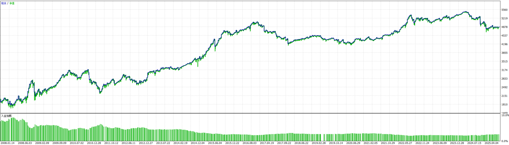
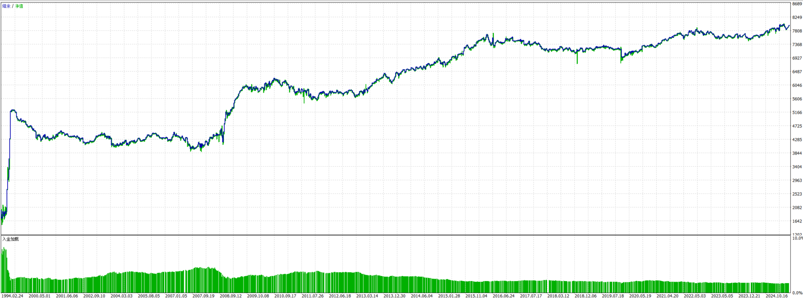
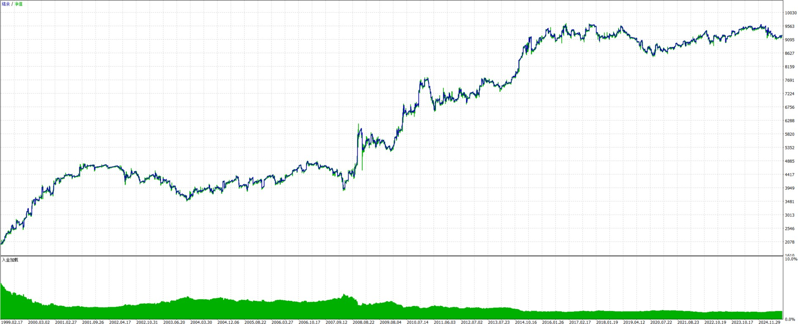

# Back-Pedal Strategies

This directory contains alternative implementations and experimental trading strategies. These are variations or earlier versions of strategies that may be used for comparison, testing, or as fallback options.

## Directory Structure

```
back-pedal/
├── RSIScalpingEURUSD/       # RSI Scalping for EUR/USD
├── RSIScalpingXAGUSD/       # RSI Scalping for Silver (XAG/USD)
├── RSIScalpingAPPL/         # RSI Scalping for Apple Stock
├── RSIReversalAsianAUDUSD/  # RSI Reversal for AUD/USD (Asian session)
├── RSIReversalAsianEURUSD/  # RSI Reversal for EUR/USD (Asian session)
└── RSIFollowReverseEMACrossOverBTCUSD/  # Multi-strategy for Bitcoin
```

## Available Strategies

### 1. RSIScalpingEURUSD
- **Instrument**: EUR/USD
- **Strategy**: RSI-based scalping
- **Performance**: See `test-balance.png`



### 2. RSIScalpingXAGUSD
- **Instrument**: Silver (XAG/USD)
- **Strategy**: RSI scalping optimized for silver
- **Performance**: See `test-balance.png`


### 3. RSIScalpingAPPL
- **Instrument**: Apple Stock (AAPL)
- **Strategy**: RSI scalping for stock trading
- **Status**: In development

### 4. RSIReversalAsianAUDUSD
- **Instrument**: AUD/USD
- **Strategy**: RSI reversal during Asian trading session
- **Time Window**: Optimized for Asian session hours
- **Performance**: See `test-balance.png`



### 5. RSIReversalAsianEURUSD
- **Instrument**: EUR/USD
- **Strategy**: RSI reversal during Asian trading session
- **Time Window**: Optimized for Asian session hours
- **Performance**: See `test-balance.jpg`



### 6. RSIFollowReverseEMACrossOverBTCUSD
- **Instrument**: Bitcoin (BTC/USD)
- **Strategy**: Multi-strategy system combining:
  - RSI Follow Strategy
  - RSI Reverse Strategy
  - EMA Cross Strategy
- **Performance**: See `test-balance.jpg`


## Purpose

These strategies serve as:
- **Alternative Implementations**: Different parameter sets or logic variations
- **Testing Ground**: Experimental features and modifications
- **Comparison Baseline**: Reference implementations for performance comparison
- **Fallback Options**: Backup strategies when primary strategies need adjustment

## Differences from Frontline

The strategies in this directory may differ from the `frontline/` versions in:
- Parameter optimization
- Entry/exit logic variations
- Risk management approaches
- Time window configurations
- Instrument-specific adaptations

## Usage Notes

⚠️ **Important**: These are experimental/alternative strategies. Always:
1. Test thoroughly on demo accounts
2. Compare performance with frontline strategies
3. Understand the differences before deployment
4. Monitor closely if used in live trading

## Performance Images

All strategies include `test-balance.png` or `test-balance.jpg` files showing:
- Equity curve over time
- Drawdown periods
- Trade distribution
- Performance metrics

## Related Directories

- **`../frontline/`**: Production-ready strategies (recommended for live trading)
- **`../ai/`**: Machine learning-based strategies
- **`../backtesting/`**: Backtesting frameworks

## Disclaimer

These strategies are provided for research and educational purposes. Past performance does not guarantee future results. Always use appropriate risk management and test thoroughly before live trading.

---

**Last Updated**: 2025-01-05
