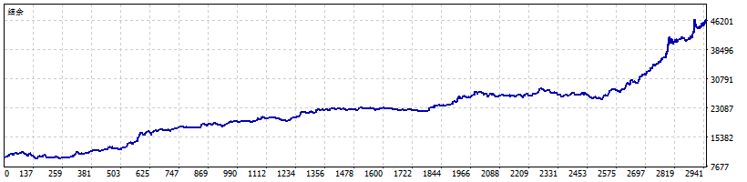
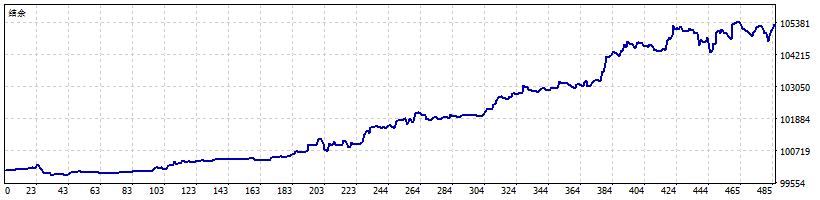
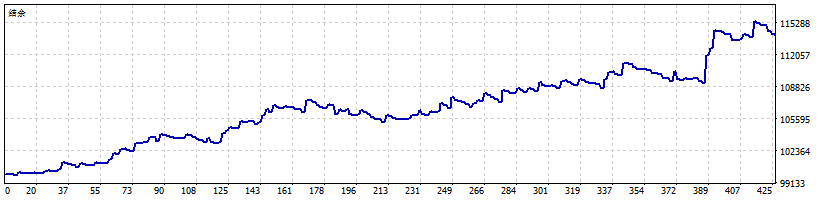
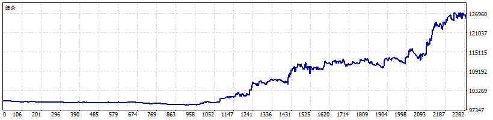

# Frontline Trading Strategies

This directory contains production-ready Expert Advisors (EAs) for MetaTrader 5, organized by strategy type and trading instrument.

## Directory Structure

```
frontline/
├── MQL5/                    # MetaTrader 5 Expert Advisors
│   ├── RSIScalpingXAUUSD/   # RSI Scalping for Gold
│   ├── RSIScalpingBTCUSD/   # RSI Scalping for Bitcoin
│   ├── RSIScalpingMSFT/     # RSI Scalping for Microsoft
│   ├── RSIScalpingTSLA/     # RSI Scalping for Tesla
│   ├── RSICrossOverReversalXAUUSD/  # RSI Crossover Reversal for Gold
│   ├── RSIMidPointHijackXAUUSD/     # RSI MidPoint Multi-Strategy for Gold
│   ├── EMASlopeDistanceCocktailXAUUSD/  # EMA Slope Distance Strategy
│   └── DarvasBoxXAUUSD/     # Darvas Box Breakout Strategy
└── tradingview/             # TradingView Pine Script strategies
    └── SSEEMARSICocktail/   # Multi-indicator cocktail strategy
```

## Available Strategies

### RSI Scalping Strategies

Fast-paced scalping strategies using RSI (Relative Strength Index) for quick entries and exits.

#### 1. RSIScalpingXAUUSD
- **Instrument**: Gold (XAU/USD)
- **Timeframe**: H1
- **Strategy**: RSI-based scalping with dynamic entry/exit
- **Key Parameters**:
  - RSI Period: 14
  - Overbought: 71
  - Oversold: 57
  - Buy Target: 80
  - Sell Target: 57
  - Bars to Wait: 4

**Performance Report:**


#### 2. RSIScalpingBTCUSD
- **Instrument**: Bitcoin (BTC/USD)
- **Timeframe**: H1
- **Strategy**: RSI scalping optimized for cryptocurrency volatility

**Performance Report:**


#### 3. RSIScalpingMSFT
- **Instrument**: Microsoft Stock (MSFT)
- **Timeframe**: H1
- **Strategy**: RSI scalping for stock trading

**Performance Report:**


#### 4. RSIScalpingTSLA
- **Instrument**: Tesla Stock (TSLA)
- **Timeframe**: H1
- **Strategy**: RSI scalping for high-volatility stocks

**Performance Report:**


### Advanced Gold Strategies

#### 5. RSICrossOverReversalXAUUSD
- **Instrument**: Gold (XAU/USD)
- **Timeframe**: M12 (12-minute bars)
- **Strategy**: RSI crossover combined with EMA trend confirmation
- **Key Features**:
  - RSI crossover signals (period: 19)
  - EMA trend confirmation (period: 140)
  - Trailing stop (295 points)
  - Time-based trading windows
  - Day-of-week filtering

**Performance Report:**


**Core Parameters:**
```mql5
rsiPeriod = 19;
overboughtLevel = 93;
oversoldLevel = 22;
emaPeriod = 140;
emaSlopeThreshold = 105;
emaDistanceThreshold = 165;
TrailingStop = 295;
```

#### 6. RSIMidPointHijackXAUUSD
- **Instrument**: Gold (XAU/USD)
- **Timeframe**: H1
- **Strategy**: Multi-strategy system combining three approaches
  - **RSI Follow Strategy**: Trend following (23:00-08:00 UTC)
  - **RSI Reverse Strategy**: Mean reversion (07:00-13:00 UTC)
  - **EMA Cross Strategy**: Breakout trading (08:00-14:00 UTC)
- **Key Features**:
  - Strategy coordination and locking
  - Cooldown periods after losses
  - Independent time windows for each strategy

**Performance Report:**


**Core Parameters:**
```mql5
// RSI Follow
InpRSIPeriod = 32;
InpRSIOverbought = 78;
InpRSIOversold = 46;

// RSI Reverse
InpRSIReversePeriod = 59;
InpRSIReverseOverbought = 51;
InpRSIReverseOversold = 49;

// EMA Cross
InpEMAPeriod = 120;
InpEMADistancePips = 160.0;
```

#### 7. EMASlopeDistanceCocktailXAUUSD
- **Instrument**: Gold (XAU/USD)
- **Timeframe**: H1
- **Strategy**: Advanced EMA-based strategy with slope and distance analysis
- **Key Features**:
  - EMA slope analysis for trend strength
  - Price distance from EMA for entry signals
  - Sophisticated scoring system
  - Dynamic ATR-based stop loss/take profit
  - Maximum drawdown protection

**Performance Report:**


**Performance Metrics:**
- Yearly Return: 28%
- Profit Factor: 1.222
- Recovery Factor: 7.17
- Sharpe Ratio: 4.11
- Maximum Drawdown: 14.00%
- Win Rate: 64.65%
- Total Trades: 2,863

**Core Parameters:**
```mql5
emaPeriod = 64;
slopeThreshold = 82;
distanceThreshold = 17.5;
atrMultiplier = 7.6;
TrailingStop = 335;
scoreThreshold = 5200;
```

#### 8. DarvasBoxXAUUSD
- **Instrument**: Gold (XAU/USD)
- **Timeframe**: H2 (trend), Current (trading)
- **Strategy**: Darvas Box breakout strategy
- **Key Features**:
  - Identifies consolidation boxes
  - Trades breakouts with volume confirmation
  - Multiple timeframe trend analysis
  - Dynamic box sizing based on volatility

**Performance Report:**


**Core Parameters:**
```mql5
BoxPeriod = 165;
BoxDeviation = 25140;
VolumeThreshold = 938;
StopLoss = 1665;
TakeProfit = 3685;
MA_Period = 125;
```

## TradingView Strategies

### SSEEMARSICocktail
- **Platform**: TradingView
- **Language**: Pine Script
- **Strategy**: Multi-indicator cocktail combining:
  - SSE (Smoothed Stochastic Exponential)
  - EMA (Exponential Moving Average)
  - RSI (Relative Strength Index)
- **Files**:
  - `main.pine`: Basic version
  - `main_enhanced.pine`: Enhanced version with additional features
  - `README.md`: Detailed documentation

## Performance Reports

All strategies include comprehensive HTML backtest reports (`report.html`) and visual performance charts (`report.png`) showing:

- **Equity Curve**: Account balance over time
- **Drawdown Analysis**: Maximum drawdown periods
- **Trade Statistics**: Win rate, profit factor, average win/loss
- **Monthly Performance**: Month-by-month returns
- **Trade Distribution**: Profit/loss distribution

## Usage

### Installing EAs

1. Copy the EA file (`main.mq5`) to your MT5 `MQL5/Experts/` directory
2. Compile the EA in MetaEditor (F7)
3. Attach to chart and configure parameters
4. Enable AutoTrading in MT5

### Recommended Settings

- **Account Type**: ECN or similar with tight spreads
- **Minimum Balance**: Varies by strategy (see individual EA documentation)
- **VPS Recommended**: For 24/7 operation
- **Risk Management**: Always use appropriate lot sizes and risk limits

## Risk Management

All strategies implement:
- ✅ Stop Loss protection
- ✅ Take Profit targets
- ✅ Position sizing controls
- ✅ Spread filtering
- ✅ Maximum drawdown limits
- ✅ Time-based trading windows

## Backtesting

Each strategy has been thoroughly backtested on historical data. Results are available in:
- `report.html`: Detailed HTML report with full statistics
- `report.png`: Visual performance charts

**Important**: Past performance does not guarantee future results. Always test on demo accounts before live trading.

## Related Projects

- **`../ai/`**: ONNX machine learning models for price prediction
- **`../back-pedal/`**: Alternative strategy implementations and testing
- **`../backtesting/`**: Python backtesting framework for strategy development

## Disclaimer

Trading involves substantial risk of loss. These Expert Advisors are provided for educational and research purposes. Always:

1. Test thoroughly on demo accounts
2. Understand the strategy logic before use
3. Use appropriate risk management
4. Monitor performance regularly
5. Never risk more than you can afford to lose

Past performance does not guarantee future results. Market conditions change, and strategies may need adjustment over time.

## Support

For questions or issues:
- Review the individual EA code comments
- Check the HTML backtest reports for performance details
- Test on demo accounts first
- Adjust parameters based on your risk tolerance

---

**Last Updated**: 2025-01-05
